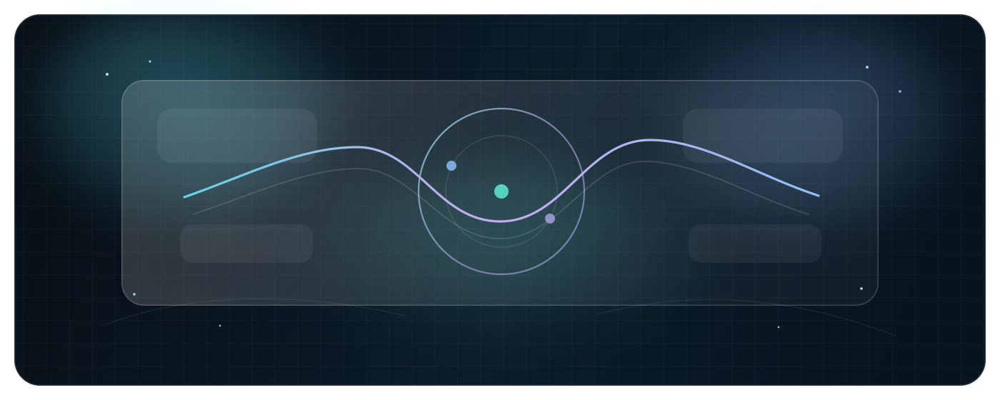

  

<h1 align="center">Ujala Agarwal</h1>

  <strong>Cloud-first builder focused on AWS workflows, deployable applications, and frontend systems that feel intentional.</strong>

  I care about the full surface of software: how it works, how it ships, and how it feels when someone actually uses it.

  
  
  
  

<table>
  <tr>
    <td width="58%" valign="top">
      <h3>Signal Over Noise</h3>
      
This profile is built around visible proof instead of filler: public repositories, verified live apps, and projects that show both technical direction and presentation quality.

      
The clearest pattern across the work is a blend of cloud execution and interface care. That combination is where the strongest public signal lives.

    </td>
    <td width="42%" valign="top">
      <h3>Live Right Now</h3>
      
<a href="https://receiptpulse-cloud-demo.onrender.com/">ReceiptPulse</a> 
      <a href="https://lumenstack-ai.onrender.com/">LumenStack AI</a> 
      <a href="https://atlasiq-ops-platform.onrender.com/">Atlasiq Ops Platform</a> 
      <a href="https://ujala-portfolio.onrender.com/">Portfolio</a>

    </td>
  </tr>
</table>

## Live Products

<table>
  <tr>
    <td width="50%" valign="top">
      <h3>ReceiptPulse</h3>
      
Serverless receipt-processing project built around AWS Textract and Lambda.

      
<code>AWS</code> <code>Textract</code> <code>Lambda</code> <code>Frontend Delivery</code>

      
<a href="https://receiptpulse-cloud-demo.onrender.com/">Live App</a> | <a href="https://github.com/agarwalujala3-lang/ReceiptPulse">Repository</a>

    </td>
    <td width="50%" valign="top">
      <h3>LumenStack AI</h3>
      
Public JavaScript application with a live deployed experience and stronger UI presentation.

      
<code>JavaScript</code> <code>Web App</code> <code>Product Surface</code>

      
<a href="https://lumenstack-ai.onrender.com/">Live App</a> | <a href="https://github.com/agarwalujala3-lang/LumenStack-AI">Repository</a>

    </td>
  </tr>
  <tr>
    <td width="50%" valign="top">
      <h3>Atlasiq Ops Platform</h3>
      
Operations-focused JavaScript project with a public deployment and dashboard-style presentation.

      
<code>JavaScript</code> <code>Operations UI</code> <code>Frontend Systems</code>

      
<a href="https://atlasiq-ops-platform.onrender.com/">Live App</a> | <a href="https://github.com/agarwalujala3-lang/Atlasiq-Ops-Platform">Repository</a>

    </td>
    <td width="50%" valign="top">
      <h3>Portfolio</h3>
      
Public portfolio site used as the presentation layer for projects, links, and hiring-facing narrative.

      
<code>HTML</code> <code>CSS</code> <code>Personal Brand</code>

      
<a href="https://ujala-portfolio.onrender.com/">Live App</a> | <a href="https://github.com/agarwalujala3-lang/ujala-portfolio">Repository</a>

    </td>
  </tr>
</table>

## Selected Build Set

| Repository | Why It Earns A Place Here | Link |
| --- | --- | --- |
| **Nexora-Prime** | Public JavaScript build that expands the active application set | [View Repo](https://github.com/agarwalujala3-lang/Nexora-Prime) |
| **Safety-Copilot** | Public Dart repository that broadens the technical range on the profile | [View Repo](https://github.com/agarwalujala3-lang/Safety-Copilot) |
| **Amazon-UI-Clone** | UI clone project that contributes frontend practice and visual implementation work | [View Repo](https://github.com/agarwalujala3-lang/Amazon-UI-Clone) |
| **DockerTestApp** | Public JavaScript repo that reinforces experimentation across environments and app delivery | [View Repo](https://github.com/agarwalujala3-lang/DockerTestApp) |
| **VALENTINE-CHAUDHRAIN** | Smaller public web project kept as part of the visible creative build set | [View Repo](https://github.com/agarwalujala3-lang/VALENTINE-CHAUDHRAIN) |

## How I Like To Build

- Shipped work beats broad claims.
- Cloud execution and interface polish are the strongest current themes across the profile.
- I aim for software that feels complete, deliberate, and reviewable.

## Core Stack

  
  
  
  
  
  
  

  
<strong>Profile Note</strong>

Everything shown here is based on public repositories and verified live links currently associated with this GitHub account. The visual design is more elevated, but the hiring-relevant content stays in plain text for clarity, accessibility, and easy review.

Updated July 1, 2026.

